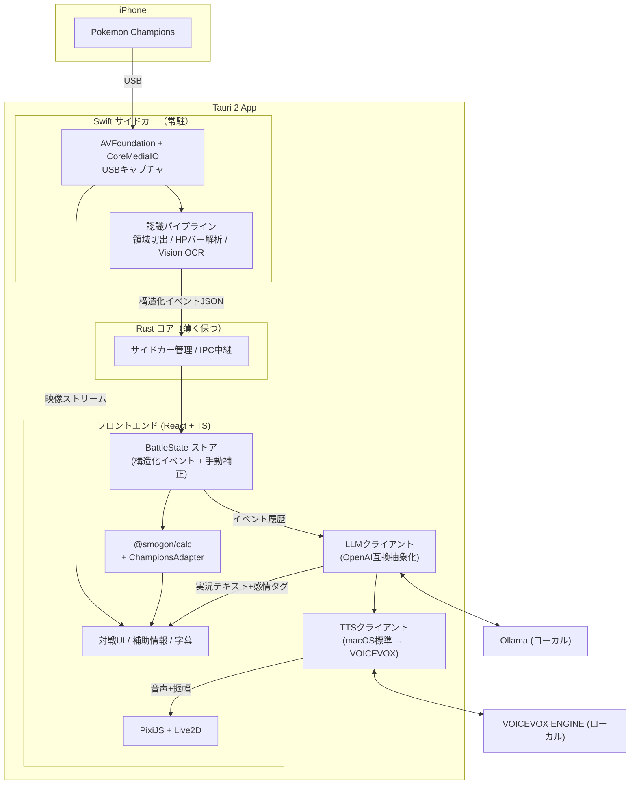

# ポケモンチャンピオンズ支援アプリ プロジェクトプラン

作成日: 2026-07-09
ステータス: Draft v1
前提ドキュメント: [technical-candidates.md](./technical-candidates.md)

## 1. プロジェクト概要

iOS版「ポケモンチャンピオンズ」のゲーム画面をMacに取り込み、対戦状況を認識してダメージ計算・行動候補を表示し、さらにVTuber風アバターがローカルLLMで実況・会話する「AI実況つき対戦支援アプリ」を開発する。

最終的なUI構成イメージは「VTuberの生放送画面」。ゲーム画面・補助情報パネル・アバター・字幕/コメントが1つのウィンドウに同居する。

### ゴール（段階的）

1. **MVP**: iPhone画面のリアルタイム表示 + 手動入力補助つきダメージ計算
2. **認識自動化**: 場のポケモン・HP・状態の自動検出とユーザー補正UI
3. **AI実況**: 構造化イベントからローカルLLMが実況テキスト/音声を生成
4. **VTuber化**: Live2Dアバター + TTS + 音声会話

## 2. ゲーム固有仕様の確認結果（2026年7月時点）

技術選定の前提となる、ポケモンチャンピオンズの対戦仕様を調査した。

| 項目 | 内容 |
| --- | --- |
| 現行レギュレーション | M-B（2026-06-17 〜 2026-09-02） |
| 使用可能ポケモン | 全319種（通常242 + メガシンカ77） |
| メガシンカ | **使用可能**。メガストーン所持、1試合1回のみ |
| テラスタル | **現状なし**。将来「ゼンブイリング」で導入予定と公式発表あり |
| ダイマックス / Zワザ | 使用不可 |
| 育成 | VP（ビクトリーポイント）でスカウト・トレーニング。努力値・個体値相当の概念あり |

**プランへの影響:**

- ダメージ計算は「メガシンカあり・テラスタルなし」の本編準拠式でスタートできる。`@smogon/calc` はGen1〜9の全世代式＋メガシンカ対応済みなのでそのまま適用可能性が高い。
- ただしチャンピオンズ独自の数値差分（例: ZA新規メガの種族値・特性）が随時追加されるため、**データ上書きレイヤー（独自パッチ層）を最初から設計に含める**。
- テラスタル導入が公式予告されているので、計算エンジンの入力モデルにはテラスタル用フィールドを予約しておく（`@smogon/calc` はGen9でテラスタル対応済みなので追従は容易）。

## 3. 技術選定の結論

各カテゴリの候補を比較検討した結果と選定理由。詳細な候補リストは technical-candidates.md を参照。

### 3.1 アプリ本体: **Tauri 2 + React + TypeScript** ✅

| 候補 | 評価 | 理由 |
| --- | --- | --- |
| **Tauri 2** | ◎ 採用 | 軽量（バンドル〜10MB、アイドルRAM 80-120MB）。Web UIでLive2D・字幕・オーバーレイが作りやすい。サイドカー機構でSwiftネイティブ処理を統合できる |
| SwiftUI + AppKit | ○ 次点 | キャプチャ・Visionとの相性は最強だが、Live2DとTS製ダメージ計算の統合にWebView+IPCが必要になり、結局ハイブリッド構成になる |
| Electron | △ | プロトタイプは速いがアイドルRAM 300-500MB。常時映像処理+LLM+アバター同居ではメモリ余裕を確保したい |
| Web + 常駐プロセス | △ | 配布体験が複雑。キャプチャ権限管理も分散する |

**決め手:**

1. ダメージ計算（`@smogon/calc`、TypeScript製）を**フロントエンドに直接バンドルできる**。IPC不要で最速。
2. アバター（pixi-live2d-display系、PixiJS）・字幕・アニメーションUIがWeb技術でそのまま作れる。
3. ネイティブが必須な部分（画面キャプチャ・Vision/Core ML）は**Swiftサイドカー**として分離するパターンが確立されている（Tauri公式ドキュメント + 実例あり）。
4. LLM・画像認識と同居させるため、アプリ本体のフットプリントは小さいほど良い。

**留意点:** Rust側の変更はリコンパイルが必要（30-60秒）。Rust層は薄く保ち、ロジックはTS側とSwiftサイドカー側に寄せる。

### 3.2 画面取り込み: **Swiftサイドカー（AVFoundation + CoreMediaIO、USB接続）** ✅

| 候補 | 評価 | 理由 |
| --- | --- | --- |
| **AVFoundation + CoreMediaIO** | ◎ 採用 | 2026年現在も動作確認済み。USB接続でアプリ内に直接生BGRAフレーム（`CVPixelBuffer`）が届く。デコード不要・低遅延・無線より安定 |
| ScreenCaptureKit | ○ フォールバック | iPhoneミラーリングウィンドウのキャプチャ用に第2の入力ソースとして実装余地を残す |
| AirPlay系 / iPhoneミラーリング | △ | 遅延・環境依存が大きい。中核入力にはしない |
| HDMI + キャプチャカード | △ | 機材ハードルが高い。UVCデバイスとして将来対応は可能 |

**実装上の既知の罠（調査で判明、PoCで必ず検証）:**

- `kCMIOHardwarePropertyAllowScreenCaptureDevices` 設定→デバイス出現まで数秒の遅延がある。
- 設定を短時間に繰り返すとレート制限がかかり、最大60秒待たされる。**プロパティを設定したプロセスを常駐させる設計にする**（サイドカーが常駐するので相性が良い）。
- `DiscoverySession` を一度呼ばないと `AVCaptureDeviceWasConnected` 通知が発火しない（ウォームアップ呼び出しが必要）。
- デバイスは `.external` + `.muxed` メディアタイプで判別する。

### 3.3 画像認識: **Swiftサイドカー内で Vision + Core ML、段階導入** ✅

| 手法 | 用途 | フェーズ |
| --- | --- | --- |
| 固定領域切り出し + ピクセル解析 | HPバーの色・長さ→HP割合、場面変化検出 | Phase 2 |
| Vision `VNRecognizeTextRequest` | ポケモン名・HP数値・技名・メニュー文字のOCR | Phase 2 |
| テンプレートマッチング | UIアイコン（状態異常・天候アイコン等）の判別 | Phase 2 |
| Core ML（YOLO変換モデル） | 場のポケモン検出・種別推定 | Phase 3以降（必要になったら） |

**方針:**

- キャプチャと認識を同じSwiftサイドカーに置くことで、フレームのプロセス間コピーを避ける。認識結果（構造化イベントJSON）だけをTauri側へ送る。
- 表示用の映像はサイドカーから低頻度JPEG/共有テクスチャで送るか、PoCの結果次第でサイドカーの映像を別レイヤー合成する。**ここはPoC 1の検証項目**。
- **「ポケモン種別の完全自動認識」はMVPの必須要件にしない。** まずOCR（名前表示は文字で読める）とHPバー解析で大半の情報が取れる見込み。3Dモデルの物体検出は精度リスクが高く、名前OCRで代替できる場面が多い。
- 全ての自動認識結果はUIで即座に手動補正できる設計とする（設計論点「完全自動認識か、ユーザー補正込みか」の結論）。

### 3.4 ダメージ計算: **`@smogon/calc` + 独自パッチレイヤー** ✅

| 候補 | 評価 | 理由 |
| --- | --- | --- |
| **`@smogon/calc`** | ◎ 採用 | v0.11.0（2026-03リリース）で活発に保守中。実績最大（Showdown公式計算機の中核）。ダメージレンジ・確定数・説明文を取得可能。`adaptable` エントリポイントで `@pkmn/data` と統合できる |
| `@pkmn/dmg` | ○ 監視 | 設計は後継的で筋が良いが、成熟度・更新頻度で `@smogon/calc` に劣る。将来移行の選択肢として監視 |
| `showdown-calc-cli` | × | アプリ組み込みならライブラリ直接利用が正解 |
| 独自実装 | × | 検証コストが重すぎる。差分吸収はパッチレイヤーで対応 |

**アーキテクチャ:**

```
BattleState（アプリ内の対戦状態モデル）
  → ChampionsAdapter（チャンピオンズ固有差分を吸収する変換層）
    → @smogon/calc の calculate()（メガシンカ対応世代の式）
      → DamageResult（レンジ・確定数・説明文）→ UI表示
```

- `ChampionsAdapter` が、種族値・特性・技威力のチャンピオンズ独自差分をデータパッチとして適用する。
- データソースは `@pkmn/data`（Showdown由来）をベースに、チャンピオンズ差分をJSONパッチで上書き。
- テラスタル導入予告に備え、`BattleState` にはテラスタル関連フィールドを予約。

### 3.5 ポケモンデータ: **`@pkmn/data` ベース + 差分パッチ** ✅

- `@pkmn/data` / `@pkmn/dex`: `@smogon/calc/adaptable` と直結できるため主データソースに採用。
- PokeAPI: 図鑑画像・日本語名などの補助データ取得に限定利用（ビルド時にローカルへキャッシュし、実行時はオフライン完結）。
- チャンピオンズ差分（新メガの種族値等）は `data/champions-patch/` に独自JSONで管理。

### 3.6 LLM実況: **Ollama（OpenAI互換API抽象化つき）** ✅

| 候補 | 評価 | 理由 |
| --- | --- | --- |
| **Ollama** | ◎ 採用 | TTFT（初回トークンまで）が最速クラス（実測175ms前後）で対話・実況向き。OpenAI互換API。セットアップ1コマンド。v0.19+でMLXバックエンドも選択可能になった |
| MLX / mlx-lm | ○ 将来 | スループットは最速（+15-46%）だがPython統合が必要。Ollama経由でMLXバックエンドを使えるようになったため、直接統合の必要性は低下 |
| llama.cpp直接 | △ | モデル管理・API化を自前で持つ理由がない |
| LM Studio | △ | GUIアプリ前提でヘッドレス利用に不向き |

**方針:**

- クライアントはOpenAI互換APIインターフェースで抽象化。開発初期は外部API（デバッグ用）、本番はOllamaローカル、と切り替え可能にする。
- 実況はリアルタイム性重視なので**小型モデル（4B〜9Bクラス、日本語対応）**から検証。候補: Qwen3系、Swallow系（日本語継続事前学習モデルはQ4量子化でも品質劣化が少ないという報告あり）。
- **LLMには画面画像ではなく構造化イベントJSONのみを渡す**（幻覚抑制・レイテンシ削減）。プロンプトに含める情報をイベント履歴＋現在の盤面に限定する。

### 3.7 音声合成: **段階導入（macOS標準 → VOICEVOX）** ✅

1. **Phase 3（実況導入時）**: `AVSpeechSynthesizer`（macOS標準）で音声出力パイプラインを確立。追加依存ゼロ。
2. **Phase 4（キャラ性強化）**: VOICEVOX ENGINEをローカルHTTPサーバーとして連携。無料・商用可（クレジット表記等の利用規約遵守が条件。キャラクターごとの規約確認が必要）。
3. Style-Bert-VITS2等は「オリジナル音声が欲しくなったら」の将来課題として保留。

TTSクライアントも抽象インターフェースにして差し替え可能にする。

### 3.8 アバター: **ダミーアバター（抽象化レイヤーのみ実装）— Live2Dは後回し** ✅

**決定（2026-07-11）: Live2Dは本質ではないため一旦保留し、ダミーアバターで進める。**

- アバター描画は `AvatarRenderer` 抽象インターフェースとして定義し、当面は**ダミー実装（静止画やシンプルなスプライト。表情差分・口パク開閉くらいの簡易表現）**で進める。
- インターフェースには「発話中フラグ」「音声振幅」「感情タグ」を渡す設計とし、実況・TTSパイプラインはダミーアバターのままフル検証できるようにする。
- 将来Live2Dを載せる場合の候補は `untitled-pixi-live2d-engine`（MIT、PixiJS v8 + Cubism 2〜5対応、リップシンク内蔵）。ただしLive2D社のライセンスで「アバターシステム・AIチャットボット等の拡張性アプリケーション」は個人でも別途契約・審査が必要になる可能性があるため、採用判断時に規約確認を行う。VRM形式（three-vrm、MIT）も代替候補。

### 3.9 音声認識（会話機能）: **whisper.cpp（Phase 4以降）**

- ユーザーとの音声会話はPhase 4のスコープ。whisper.cppをサイドカーとして追加する想定。
- リアルタイム性が必要になったらsherpa-onnxを再評価。MVP〜Phase 3では実装しない。

## 4. システムアーキテクチャ



### データフローの核: 構造化イベント

すべての機能（ダメージ計算・実況・字幕・アバター表情・ログ）は同一のイベントストリームから駆動する。

```json
{
  "type": "pokemon_switched_in",
  "timestamp": 1720000000,
  "side": "opponent",
  "pokemon": "Garchomp",
  "hpPercent": 100,
  "confidence": 0.92,
  "source": "ocr",
  "field": { "weather": "rain", "terrain": null }
}
```

- `confidence` と `source`（`ocr` / `hp_bar` / `manual` / `inferred`）を必ず持たせ、低信頼の情報はUI上で「未確認」表示にしてワンタップ補正できるようにする。
- 手動補正もイベント（`source: "manual"`）として流し、以降の自動認識より優先する。

### 処理頻度の設計

| 頻度 | 処理 |
| --- | --- |
| 毎フレーム（30-60fps） | 映像表示、軽量差分検出（場面変化の検出のみ） |
| 数fps | HPバー解析、場の領域チェック |
| イベント発生時のみ | OCR、ダメージ再計算、LLM実況生成 |
| ユーザー操作時 | 手動補正、技選択、詳細計算 |

## 5. 開発フェーズ計画

### Phase 0: PoC（リスク潰し）— 最優先

技術候補メモのPoC 1〜3に対応。**この3つが通ればプロジェクトは成立する**ので最初にやる。

| # | PoC | 成功条件 | 検証する固有リスク |
| --- | --- | --- | --- |
| 0-1 | Swift CLIでUSB iPhoneキャプチャ | 10分間フレーム取得が安定。フレームレート・遅延を計測 | CoreMediaIOのレート制限・切断復帰 |
| 0-2 | フレーム→Tauri表示経路 | サイドカー→WebViewへの映像転送方式を決定（JPEG/生バッファ/共有メモリ比較） | 映像転送のCPU負荷・遅延 |
| 0-3 | `@smogon/calc` 単体検証 | チャンピオンズの実対戦ダメージと計算結果を照合（メガシンカ含む10ケース以上） | 本編式とチャンピオンズ式の一致度 |

成果物: 各PoCの計測結果メモ（`docs/poc-results.md`）。ここで大きな乖離が出たら構成を再検討する。

### Phase 1: MVP「ゲーム画面連動・双方向ダメージ計算ツール」

MVPの中核は**双方向同時のダメージ計算**（決定 2026-07-12）。「自分→相手の打点」と「相手→自分の被弾リスク」は対戦中常にセットで考えるものなので、片方向ずつ切り替える計算機ではなく、**1枚の対面カードで両方向を同時に表示する**。

#### メインウィンドウのレイアウト

ゲーム画面を広く取り、**ゲーム画面:ダメージ計算パネル ≒ 3:1**（決定 2026-07-12）。

```
+----------------------------------------------------------+----------------+
|                                                          |  アバター枠     |
|                                                          |  (ダミー表示)   |
|              ゲーム画面 (MJPEGストリーム)                  +----------------+
|                     ※縦方向の約3/4                        |  字幕/実況枠    |
|                                                          |  (ダミー表示)   |
|                                                          |                |
+----------------------------------------------------------+----------------+
|              対面ダメージ計算パネル（コンパクト・約1/4）                     |
| [自分: ガブリアス @ハチマキ] [技: げきりん ▼]   ＼                          |
|   → [無振り  ███████░░░]                                                     |
|      [H+32   ████████░░]                         ＼                           |
|      [H+B+32 █████████░]                                                     |
|                ＼   [相手: メガゲンガー] [技: シャドボ ▼]                  |
|   ← [無振り  ███████░░░]                                                     |
|      [+32    ██████░░░░]                                                     |
|      [+32補正 █████░░░░░]                                                    |
+--------------------------------------------------------------------------+
```

- **左上半分 = 自分→相手** / **右下半分 = 相手→自分**。対角線は「対面」のメタファー。
- 両方向とも入力を変えたら**即座に再計算される**リアクティブ設計。
- アバター枠・字幕枠は**最初からレイアウトに組み込む**（ダミー表示）。Phase 3/4実装時にレイアウトが壊れないようにするため。

#### 入力仕様（決定 2026-07-12）

- **ポケモン名**: 手動入力必須（将来の自動検出の誤りを修正する経路を最初から確保）。日本語インクリメンタル検索。
- **持ち物欄**: 両側に用意。検索式プルダウン。
- **技**: 各側**1技のみ表示**。①プルダウンでそのポケモンの覚える技（learnsetデータ）から選択、②手打ちの予測変換（技名インクリメンタル検索）の両対応。
- **ルール**: シングルバトル優先。ダブルは対面カードの多対多化が必要なためPhase 2以降。

#### 相手側の想定パターン（3プリセット同時表示・HPバー）

相手の能力ポイント配分は対戦中には分からないため、方向ごとに3パターンの計算結果を**横長HPバー3本（縦並び）**で常に表示する。各バーには残HP、乱数幅、ダメージ%、確定数を併記する。

**チャンピオンズの育成仕様（2026-07-15 再確認済み）:**
- 能力ポイント: **1ステータス0〜32、合計66**。1ポイント = Lv50の実数値+1。従来EVを入力する仕様ではない
- 個体値: 全員31固定 / レベル: Lv50相当
- 最大32ポイント時の実数値は、従来作のLv50・EV252時と一致する。ただし途中配分と合計上限は異なるため、UI・保存データではEVに置き換えず能力ポイントをそのまま扱う
- `@smogon/calc` への適用: 生のCLI/APIは能力ポイントを受け付けない。アプリの`ChampionsAdapter`が能力ポイントを実数値へ変換してからエンジンへ渡す（検証: `apps/desktop/scripts/champions-verify.mjs`）

**`@smogon/calc`の適合範囲:**

| 項目 | 判定 |
| --- | --- |
| Lv50基礎ダメージ式、乱数、STAB、タイプ相性、天候、壁等 | 利用可能（チャンピオンズもGen 6+標準式ベース） |
| 能力ポイント | ネイティブ非対応。`ChampionsAdapter`で変換が必要 |
| 既存ポケモン・技・特性・持ち物 | Showdownデータの範囲で利用可能 |
| チャンピオンズ新規メガ・独自調整 | **保証なし**。ゲーム内実測および公式/攻略データとの差分パッチが必要 |
| ゲーム固有ルール（使用可能ポケモン、メガ1回等） | 計算エンジン外。アプリ側で制御 |

| 方向 | プリセット | 内容 |
| --- | --- | --- |
| 自分→相手（相手の耐久想定） | 無振り | HP+0 / 耐久+0 |
| | H+32 | HP+32 / 耐久+0 |
| | H+32・耐久+32 | HP+32 / 防御(B)または特防(D)+32 |
| 相手→自分（相手の火力想定） | 無振り | 攻撃(A)または特攻(C)+0 |
| | +32 | 攻撃(A)または特攻(C)+32 |
| | +32+性格補正 | +32 + 性格1.1倍（いじっぱり/ひかえめ等） |

- 物理/特殊は技のカテゴリから自動判別し、該当する側（B or D / A or C）にプリセットを適用する。
- 自分側は実際の育成が分かっているため、H/A/B/C/D/Sの能力ポイントと性格を直接入力できる。各0〜32・合計66をUIで強制する。

#### タスク

- モノレポ整備（`apps/desktop` + `sidecars/capture`。PoC資産を移植・本実装化）
- サイドカー本実装化（デバイス喪失→再探索ループ、フレーム途絶ウォッチドッグ、fpsスケジューリング改善）
- BattleStateストア（自分側・相手側の対称構造。手動入力を`source: "manual"`イベントとして扱う）
- 対面ダメージ計算パネル（上記レイアウト。双方向同時計算・リアクティブ更新）
- ポケモン・技の入力UI(日本語インクリメンタル検索。`@pkmn/data`の翻訳データ利用)
- `@smogon/calc` + ChampionsAdapter統合（タイプ無効時の単一0返却対応）
- チャンピオンズ実対戦ダメージとの照合（10ケース以上）→ 差分パッチの要否判断
- ルールはシングルバトル優先（ダブルは対面カードの多対多化が必要なためPhase 2以降で検討）

**この時点で「iPadの画面を見ながら、双方向のダメ計が常時見えるツール」として実用になる**

### Phase 2: 認識自動化

- HPバー解析（色・長さ→HP割合）
- Vision OCR（ポケモン名・HP数値・技名）
- 場面変化検出（交代・技選択画面の判定）
- 認識結果→イベント→自動でBattleState更新、信頼度表示と手動補正UI
- 解像度・レイアウト差分への対応（領域定義の外部設定化）

### Phase 3: AI実況

- 構造化イベント→LLMプロンプト生成（イベント履歴の要約管理）
- Ollamaクライアント（OpenAI互換抽象化、ストリーミング）
- 実況の発話タイミング制御（イベント駆動 + クールダウン、プレイの邪魔をしない）
- 字幕表示UI
- macOS標準TTSで音声出力
- 日本語小型モデルの比較検証（レイテンシ vs 品質）

### Phase 4: VTuber化

- ダミーアバター表示（`AvatarRenderer` 抽象化レイヤー + 簡易スプライト実装）
- VOICEVOX連携、口パク（音声振幅ベースの開閉、ダミーアバターで実装）
- LLM出力への感情タグ付与→表情制御（ダミーアバターの表情差分で検証）
- 音声会話（whisper.cpp）— オプション
- 配信向けレイアウト調整（OBSキャプチャを想定した画面設計）
- Live2D本実装は保留（採用時にライセンス確認の上、`AvatarRenderer` の実装差し替えで対応）

## 6. リスクと対策

| リスク | 影響 | 対策 |
| --- | --- | --- |
| ゲーム規約・フェアプレイ抵触 | プロジェクトの公開可否 | **個人利用・研究目的と位置づけて開始**。配布時はリアルタイム支援機能の扱いを再検討（実況のみモード等）。大会利用は想定しない |
| Live2D「拡張性アプリケーション」ライセンス | Phase 4の構成変更 | **当面ダミーアバターで進めるため影響なし**。Live2D採用を判断する時点で規約確認。`AvatarRenderer` 抽象化で差し替え可能にしておく |
| チャンピオンズ固有のダメージ式差分 | 計算精度 | PoC 0-3で実測照合。差分はChampionsAdapterで吸収。ダメ計コミュニティ（damekei等）の知見も参照 |
| CoreMediaIO APIの将来変更（非公開寄りの挙動） | キャプチャ経路の喪失 | ScreenCaptureKit + iPhoneミラーリングを第2経路として設計に残す |
| 認識精度（演出・エフェクト・テラスタル導入後の画面変化） | 自動化の信頼性 | 手動補正ファースト設計。認識は「補助」と位置づけ、confidence表示で誤認識の影響を局所化 |
| LLM・認識・映像処理の同時負荷 | 実用性（Macが重くなる） | 処理頻度の階層化（毎フレーム処理を最小化）。Phase 3でApple Silicon実機の負荷計測を必須タスク化 |
| レギュレーション更新（3ヶ月ごと）への追従 | データ鮮度 | ポケモン・技データをパッチJSONで外部化し、アプリ更新なしで差し替え可能にする |

## 7. リポジトリ構成案

```
poke-ai/
├── docs/                       # ドキュメント
│   ├── technical-candidates.md
│   ├── project-plan.md         # 本ドキュメント
│   └── poc-results.md          # PoC計測結果（Phase 0で作成）
├── apps/
│   └── desktop/                # Tauri 2 アプリ
│       ├── src/                # React + TS フロントエンド
│       │   ├── battle/         # BattleState・イベント処理
│       │   ├── calc/           # ChampionsAdapter + @smogon/calc 連携
│       │   ├── commentary/     # LLM実況・字幕
│       │   ├── avatar/         # アバター描画（抽象化レイヤー）
│       │   └── ui/
│       └── src-tauri/          # Rust コア + サイドカー管理
├── sidecars/
│   └── capture/                # Swift: キャプチャ + 認識サイドカー（SwiftPM）
├── packages/
│   ├── champions-data/         # チャンピオンズ差分パッチJSON
│   └── event-schema/           # 構造化イベントの型定義（TS + Swift Codable共有）
└── README.md
```

## 8. 次のアクション

**Phase 0（PoC）は2026-07-12に完了**（結果: [poc-results.md](./poc-results.md)）。キャプチャ58fps安定・MJPEG転送で体感遅延0.1秒以下・`@smogon/calc` 式検証全パス。技術構成はプラン通りで確定。

Phase 1（MVP）のタスク:

1. モノレポ整備（`apps/desktop` + `sidecars/capture`。PoCの `poc/viewer`・`poc/capture` を移植・本実装化）
2. サイドカーの本実装化（デバイス喪失→再探索ループ、フレーム途絶ウォッチドッグ、fpsスケジューリング改善）
3. BattleStateストアと手動入力UI
4. `@smogon/calc` + ChampionsAdapter 統合（タイプ無効時の単一0返却への対応、日本語名→英語IDマッピング）
5. チャンピオンズ実対戦ダメージとの照合（10ケース以上）→ 差分パッチの要否判断

## 9. 意思決定ログ

| 日付 | 決定 | 理由 |
| --- | --- | --- |
| 2026-07-09 | アプリ基盤にTauri 2を採用 | TS製ダメージ計算とLive2DをWebViewに同居でき、軽量。ネイティブ処理はSwiftサイドカーで分離 |
| 2026-07-09 | ダメージ計算に`@smogon/calc`を採用 | 2026年3月まで活発に保守、実績最大。チャンピオンズ差分はアダプター層で吸収 |
| 2026-07-09 | ポケモン種別の物体検出（YOLO/Core ML）をMVP必須から除外 | 名前OCR + HPバー解析で大半の情報が取得可能。物体検出は精度リスクが高く費用対効果が低い |
| 2026-07-09 | LLM実行環境にOllamaを採用 | TTFT最速クラスで実況向き。OpenAI互換APIで抽象化しやすく、MLXバックエンドへの道もある |
| 2026-07-09 | TTSは macOS標準 → VOICEVOX の段階導入 | パイプライン確立を優先し、キャラ性は後から強化 |
| 2026-07-11 | Live2Dを保留し、当面ダミーアバターで進行 | アバター表現は本質ではない。`AvatarRenderer` 抽象化で後から差し替え可能にし、ライセンス確認も採用判断時まで先送り |
| 2026-07-12 | 映像転送はMJPEG方式（サイドカー内蔵HTTPサーバー→``）で確定 | PoC 0-2実測で体感遅延0.1秒以下・CPU約10%と十分。H.264/WebRTCは不要な複雑化と判断 |
| 2026-07-12 | MVPは「対角分割・双方向同時ダメージ計算パネル」を中核に | 対戦では自分の打点と被弾リスクを常にセットで考えるため。対角線レイアウトで1枚のカードに両方向を同居させる。アバター/字幕枠はダミーで最初からレイアウトに確保 |
| 2026-07-15 | 育成はEVではなく能力ポイント0〜32（合計66） | チャンピオンズ固有仕様。最大投資時はLv50 EV252と同じ実数値だが、入力・保存・合計制約は能力ポイントとして扱う |
| 2026-07-15 | `@smogon/calc`はChampionsAdapter経由で限定採用 | 標準ダメージ式には使えるが能力ポイントはネイティブ非対応。新規メガ等は差分検証・パッチが必要 |
| 2026-07-15 | ダメージ表示は横長HPバー3本（縦並び） | 3プリセットの残HPと乱数幅を視覚的に比較し、%数値と確定数も併記 |
