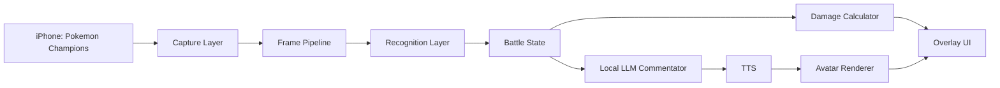

# ポケモンチャンピオンズ支援アプリ 技術候補メモ

## 概要

iOS版「ポケモンチャンピオンズ」のゲーム画面をMacに取り込み、場に出ているポケモンや対戦状況を検出し、ダメージ計算や候補行動の情報を簡単に表示するアプリを想定する。

さらに同じアプリ内にVTuber風のアバターを表示し、ローカルLLMが対戦の様子を実況したり、プレイヤーと会話したりする体験も目指す。イメージとしては、ゲーム画面、補助情報、アバター、字幕やコメントが同居する「VTuberの生放送画面」のような構成。

現時点では技術を決め打ちせず、まずは候補を広めに列挙する。初期MVPでは「画面取得」「場のポケモン検出」「ダメージ計算表示」までを優先し、LLM実況・音声・アバターは段階的に追加するのが現実的。

## 想定する主要機能

- iPhone上のポケモンチャンピオンズ画面をMacアプリへリアルタイム入力する。
- 場に出ている自分側・相手側のポケモンを検出する。
- HP、タイプ、状態異常、天候、フィールド、ランク補正など、画面から取れそうな情報を抽出する。
- 不確かな情報はユーザーが手動補正できるようにする。
- ダメージ計算エンジンと連携し、技ごとのダメージレンジや確定数を表示する。
- 対戦状況を構造化イベントとして蓄積する。
- ローカルLLMにイベントを渡し、短い実況・助言・雑談を生成する。
- アバター、字幕、音声合成、表情制御を組み合わせてVTuber風に表示する。

## 大まかな構成候補



## 画面取り込み候補

### AVFoundation + CoreMediaIO

USB接続したiPhone画面を、QuickTime Playerと同じようにMacアプリ内のキャプチャデバイスとして扱う候補。

調査上は、`kCMIOHardwarePropertyAllowScreenCaptureDevices` を有効化すると、iOSデバイスが `AVCaptureDevice` として検出できる。`AVCaptureSession` から `CMSampleBuffer` を受け取り、フレーム処理に流せる可能性が高い。

向いている点:

- アプリ内で直接フレームを取得できる。
- USB接続なので無線より安定しやすい。
- 外部ウィンドウのキャプチャに依存しない。
- MVPの中核入力として有力。

懸念点:

- macOSネイティブ実装が必要。
- デバイス検出まわりに癖がある。
- iPhone側の信頼確認、ケーブル、OSバージョンの影響を受ける。
- App Store配布まで考える場合、権限や審査観点は別途確認が必要。

### ScreenCaptureKit

Mac上のウィンドウや画面領域をキャプチャするApple公式API。iPhoneミラーリング、QuickTime Player、OBSプレビューなど、別アプリに表示した画面を取り込む用途に使える。

向いている点:

- macOSの画面・ウィンドウキャプチャとして標準的。
- iPhoneミラーリングウィンドウを対象にできる。
- UI上の任意領域を切り出しやすい。

懸念点:

- 画面収録権限が必要。
- ウィンドウ名や表示状態に依存しやすい。
- iPhoneミラーリング経由だと無線遅延や接続条件が入る。
- 自アプリ画面をキャプチャすると再帰表示に注意が必要。

### iPhoneミラーリング

macOS Sequoia 15以降とiOS 18以降で使えるApple公式機能。Mac上でiPhoneを操作でき、音声もMac側に出せる。

向いている点:

- MacからiPhoneを操作できる。
- UI確認やプロトタイプには便利。
- ScreenCaptureKitやOBSと組み合わせやすい。

懸念点:

- 対応Mac、対応OS、Apple Account、Wi-Fi/Bluetoothなど条件が多い。
- ゲームコントローラーはMacではなくiPhoneへ接続する必要がある。
- 製品の中核入力としては環境依存が大きい。

### AirPlay / Reflector / AirServer / LonelyScreen

iPhone画面をMacに無線ミラーリングする候補。サードパーティアプリをAirPlay受信機として使う方法もある。

向いている点:

- 導入が簡単。
- プロトタイプやデモには使いやすい。
- OBS連携の情報が多い。

懸念点:

- Wi-Fi品質に影響される。
- 遅延、フレーム落ち、音ズレが起きやすい。
- 自作アプリに組み込む中核技術としては弱い。

### HDMIアダプタ + キャプチャカード

iPhoneのUSB-C/LightningからHDMI出力し、キャプチャカード経由でMacに入力する構成。

向いている点:

- 配信・録画機材として一般的。
- OBSなど既存ツールと相性が良い。
- キャプチャカードがUVC対応ならアプリからも映像入力として扱いやすい。

懸念点:

- 機材コストと配線が増える。
- iPhone、アダプタ、ゲーム側の映像出力制限に影響される可能性がある。
- プレイヤーが手軽に使うアプリとしては導入ハードルが上がる。

## 画像認識・状態推定候補

### Apple Vision

macOS標準の画像認識フレームワーク。OCR、画像分類、物体検出用Core MLモデル実行などに使える。

候補用途:

- `VNRecognizeTextRequest` で名前、HP数値、メニュー文字などを読む。
- `VNCoreMLRequest` でポケモン検出モデルを実行する。
- `VNTrackObjectRequest` で検出済みポケモンの位置を追跡する。

向いている点:

- Appleプラットフォームで完結しやすい。
- Core MLモデルと組み合わせやすい。
- ネイティブアプリとの相性が良い。

懸念点:

- ポケモン種別の識別には独自モデルか特徴量DBが必要。
- ゲーム画面のエフェクト、カメラ角度、重なり、テラスタル演出に弱い可能性がある。

### Core ML

学習済みモデルをmacOS/iOS上で高速に実行するAppleのMLランタイム。

候補用途:

- YOLO系モデルをCore ML形式へ変換してポケモンの物体検出を行う。
- 画像分類モデルで、切り出したポケモン領域から種別を推定する。
- 軽量モデルを常時実行し、重い処理はイベント時だけ実行する。

向いている点:

- Apple Siliconで高速化しやすい。
- ネイティブ配布しやすい。

懸念点:

- 学習・変換・精度評価のパイプラインが必要。
- ポケモンチャンピオンズ固有の3DモデルやUIに合わせたデータが必要になる。

### OpenCV

古典的な画像処理ライブラリ。Swift/Rust/Node/Pythonなどから利用可能。

候補用途:

- 画面内の固定領域切り出し。
- HPバーやゲージの色・長さ検出。
- テンプレートマッチング。
- フレーム差分による場面変化検出。

向いている点:

- MLを使わずに処理できる部分が多い。
- UIが安定している箇所では強い。
- デバッグしやすい。

懸念点:

- 画面演出や解像度差に弱い。
- ポケモン種別の識別はOpenCV単体だと限界がある。

### YOLO / Ultralytics

物体検出モデルの候補。ポケモン検出用のサンプルリポジトリやデータセットも存在する。

候補:

- `ultralytics` のYOLOv8/YOLOv11系。
- `vovod/yolov8-pokemon-object-detection` のようなポケモン検出サンプル。
- 学習後にCore MLへ変換してMacアプリへ組み込む。

向いている点:

- 画面上のポケモン位置検出に向く。
- 学習・評価・エクスポートの情報が多い。

懸念点:

- 既存のポケモン画像データセットは公式絵や過去作素材が多く、ポケモンチャンピオンズの実画面とは分布が違う。
- 種類数が多いので、全ポケモン対応はデータ収集が大変。

### テンプレートマッチング / 画像特徴量DB

機械学習モデルではなく、ポケモンごとの参照画像と照合する候補。

候補用途:

- 場に出ているポケモンのアイコンや名前表示が安定している場合の識別。
- 最初のMVPで対象ポケモンを絞る場合。

向いている点:

- 実装が軽い。
- 少数ポケモンなら早く検証できる。
- データ追加の作業が分かりやすい。

懸念点:

- 3Dモデルの姿勢、エフェクト、拡大縮小に弱い。
- 全ポケモン対応には保守コストが高い。

## ポケモンデータ・図鑑データ候補

### PokeAPI

ポケモン、技、タイプ、特性などのデータを取得できる公開API。

向いている点:

- 取得できるデータ範囲が広い。
- プロトタイプで使いやすい。

懸念点:

- ポケモンチャンピオンズ固有のステータス、技仕様、ルール差分がある場合は足りない。
- オフライン完結にするならローカルキャッシュが必要。

### Pokemon Showdown / pkmn ecosystem

対戦データ、種族値、技、特性などの既存資産が豊富。

候補:

- `pokemon-showdown`
- `@pkmn/data`
- `@pkmn/dex`
- `@pkmn/sim`

向いている点:

- 対戦計算やルール実装に近いデータがある。
- `@pkmn/dmg` などの周辺ライブラリとつながりやすい。

懸念点:

- ポケモンチャンピオンズが本編やShowdownと完全一致するとは限らない。
- ライセンスとデータ利用範囲は確認が必要。

## ダメージ計算候補

### `@pkmn/dmg`

`pkmn` ecosystemのダメージ計算ライブラリ兼CLI。`dmg` コマンドでSmogon風の入力から計算できる。調査時点では、`@smogon/calc` の後継的な位置づけとして説明されている。

候補用途:

- CLIとしてPoCで使う。
- ライブラリAPIとしてNode/TypeScript側から使う。
- 構造化した対戦状態を `State` に変換して計算する。

向いている点:

- CLIがあるので検証しやすい。
- `@pkmn` 系データと相性が良い。
- 複数世代対応を意識した設計。

懸念点:

- ポケモンチャンピオンズ固有仕様への追従は要確認。
- API設計を読み込んで、アプリ用の入力モデルに合わせる必要がある。

参考:

- https://github.com/pkmn/dmg

### `@smogon/calc`

公式Pokemon Showdown Damage Calculatorの中核TypeScriptライブラリ。

候補用途:

- Node/TypeScriptの計算サービスとして組み込む。
- Tauri/Electronのフロントエンド内で直接使う。
- 既存UIや計算式の挙動を参考にする。

向いている点:

- 実績が大きい。
- TypeScriptで扱いやすい。
- ダメージレンジ、確定数、説明文などを取得できる。

懸念点:

- 将来のゲーム固有仕様差分をどこで吸収するか設計が必要。
- Swiftネイティブから直接使う場合はJS実行環境やIPCが必要。

参考:

- https://github.com/smogon/damage-calc
- https://www.npmjs.com/package/@smogon/calc

### `showdown-calc-cli`

`@smogon/calc` をCLIとして扱いやすくするラッパー候補。

向いている点:

- コマンドラインPoCに向く。
- 入力例を試しやすい。

懸念点:

- アプリ本体に組み込むなら、CLIラッパーより `@smogon/calc` を直接使う方がよさそう。

参考:

- https://github.com/Roshan-24/showdown-calc-cli

### 独自実装

最終的にポケモンチャンピオンズ独自の仕様が大きい場合、既存ライブラリを参考にしつつ独自計算エンジンを持つ候補。

向いている点:

- ゲーム固有仕様に合わせやすい。
- UI表示に必要な出力形式を自由に設計できる。

懸念点:

- 正確性検証が重い。
- 世代・技・特性・持ち物・場の効果の組み合わせが多い。
- 最初から独自実装するのは非推奨。

## アプリ本体・UI候補

### SwiftUI + AppKit

Macネイティブアプリとして作る候補。画面取得、Vision、Core ML、権限管理との相性が良い。

向いている点:

- AVFoundation、ScreenCaptureKit、Vision、Core MLを直接扱いやすい。
- Macアプリとしての統合感が高い。
- 低レイテンシのフレーム処理を作りやすい。

懸念点:

- Live2DやWeb系UIの資産を使う場合は工夫が必要。
- ダメージ計算がTypeScript中心ならIPCやJS実行環境が必要。

### Tauri

RustバックエンドとWebフロントエンドでデスクトップアプリを作る候補。

向いている点:

- Web UI、Live2D、字幕、オーバーレイ表現を作りやすい。
- Electronより軽量になりやすい。
- Rust側でネイティブ処理やIPCを担当できる。

懸念点:

- AVFoundationやVisionを使うにはSwift/Objective-Cブリッジか別プロセス化が必要。
- 初期実装の接続部分がやや複雑。

### Electron

Node.jsとChromiumでデスクトップアプリを作る候補。

向いている点:

- `@smogon/calc` や `@pkmn/dmg` を同じJS/TS環境で扱いやすい。
- Live2D、字幕、アニメーションUIに強い。
- プロトタイプが速い。

懸念点:

- 重くなりやすい。
- macOSネイティブの画面取得は別実装が必要。
- 常時映像処理、LLM、アバターを同居させると負荷管理が重要。

### Webアプリ + ローカル常駐プロセス

ブラウザUIとローカルバックエンドを分離する候補。

向いている点:

- UI開発が速い。
- LLMや計算サービスをHTTP/WebSocketでつなぎやすい。
- 後からデスクトップ化しやすい。

懸念点:

- 画面取り込み権限やiPhoneキャプチャはローカルプロセス側が必要。
- 配布体験はデスクトップアプリより複雑になりやすい。

## LLM・実況候補

### Ollama

ローカルLLMを簡単に起動し、HTTP APIで呼べる実行環境。

向いている点:

- セットアップが簡単。
- OpenAI互換APIとして扱いやすい。
- モデル差し替えが容易。

懸念点:

- ユーザー環境にOllamaを入れてもらう必要がある。
- リアルタイム実況にはモデルサイズとレイテンシ調整が必要。

### llama.cpp / GGUF

軽量なローカルLLM実行候補。アプリに同梱または別プロセスとして利用する。

向いている点:

- オフライン完結しやすい。
- 量子化モデルを使いやすい。
- 配布構成をコントロールしやすい。

懸念点:

- モデル管理、GPU/CPU最適化、API化を自前で考える必要がある。

### MLX

Apple Silicon向けの機械学習フレームワーク。LLMや音声モデルの高速実行候補。

向いている点:

- Apple Siliconで性能を出しやすい。
- macOSローカルAIアプリとの相性が良い。

懸念点:

- Intel Mac対応を切るか、別バックエンドが必要。
- 実装の自由度が高い分、統合作業は増える。

### OpenAI互換API抽象化

ローカルLLM、LM Studio、Ollama、外部APIを同じインターフェースで扱う候補。

向いている点:

- 初期開発時は外部API、本番はローカルLLMなど切り替えやすい。
- モデル比較がしやすい。

懸念点:

- 完全ローカルを要件にする場合は外部APIをオプション扱いにする必要がある。

## 音声認識・音声合成候補

### whisper.cpp

ローカル音声認識の候補。

向いている点:

- オフラインで使える。
- 日本語も扱える。
- 実績が多い。

懸念点:

- 常時待ち受けや低遅延会話にはチューニングが必要。

### sherpa-onnx

オンデバイス音声認識・音声処理の候補。

向いている点:

- リアルタイム寄りの構成にしやすい。
- Open-LLM-VTuberなどでも採用候補として出てくる。

懸念点:

- モデル選定と日本語精度の検証が必要。

### VOICEVOX系

日本語TTS候補。

向いている点:

- 日本語音声の品質が高い。
- キャラクター性を出しやすい。

懸念点:

- ライセンス、利用条件、配布形態の確認が必要。
- 常時リアルタイム実況ではレイテンシ確認が必要。

### Style-Bert-VITS2 / GPT-SoVITS系

キャラクター音声や感情表現を重視する場合の候補。

向いている点:

- VTuber風体験との相性が良い。
- 音声の個性を作りやすい。

懸念点:

- セットアップやモデル管理が重い。
- 配布、権利、レイテンシの課題が大きい。

### macOS標準音声合成

まず音声出力を試すための軽量候補。

向いている点:

- 追加依存が少ない。
- MVPで使いやすい。

懸念点:

- キャラクター性は弱い。

## アバター表示候補

### Live2D Cubism SDK

Live2Dモデルを表示・制御する公式系SDK。

向いている点:

- VTuber風の表現に直結する。
- 表情、口パク、モーションを制御できる。

懸念点:

- ライセンス確認が必要。
- ネイティブ統合かWeb統合かで実装が変わる。

### pixi-live2d-display

WebフロントエンドでLive2Dを扱う候補。

向いている点:

- Electron/Tauri/Web UIと相性が良い。
- プロトタイプが速い。

懸念点:

- モデル形式やCubismバージョン対応を確認する必要がある。
- 商用利用や配布時のライセンス確認が必要。

### Open-LLM-VTuber

ローカルLLM、音声認識、TTS、Live2Dアバターを組み合わせたOSS。

候補用途:

- アバター・会話部分の参考実装。
- 既存コンポーネントを別プロセスとして利用できるか検証。
- 最初から全部自作しないための比較対象。

向いている点:

- やりたい体験に近い。
- macOS対応、ローカルLLM、Live2D、音声会話の情報がまとまっている。

懸念点:

- ポケモン画面認識やダメージ計算とは別領域なので統合設計が必要。
- そのまま組み込むより、参考または別サービス連携が現実的かもしれない。

参考:

- https://github.com/Open-LLM-VTuber/Open-LLM-VTuber

## 既存OSS・データセット候補

### ダメージ計算

- `@pkmn/dmg`: ダメージ計算ライブラリ兼 `dmg` CLI。最初に試す価値が高い。
- `@smogon/calc`: Pokemon Showdown公式計算機の中核。TypeScript統合に向く。
- `showdown-calc-cli`: CLI検証用の軽量候補。

### ポケモンデータ

- `pokemon-showdown`: 対戦データやルール実装の参照候補。
- `@pkmn/data`: pkmn系のデータ候補。
- `PokeAPI`: 図鑑・技・タイプ情報の取得候補。

### 画像認識・データセット

- `fcakyon/pokemon-classification`: Hugging Face上のポケモン分類データセット。
- `jneuendorf/pokemon-image-dataset`: 各世代のポケモン画像データセット。
- `vovod/yolov8-pokemon-object-detection`: YOLOv8でポケモン検出を試したサンプル。
- Roboflow UniverseのPokedex系データセット。

### LLM / VTuber

- `Open-LLM-VTuber`: ローカルLLM、ASR、TTS、Live2Dの統合参考。
- `Ollama`: ローカルLLMの実行環境。
- `llama.cpp`: GGUFモデル実行。
- `LM Studio`: OpenAI互換APIで使えるローカルLLM環境。

## 重要な設計論点

### 完全自動認識か、ユーザー補正込みか

最初から完全自動で場の状態をすべて取るのは難しい。ポケモン、HP、技、持ち物、特性、ランク補正、天候、フィールド、テラスタルなど、ダメージ計算に必要な情報は多い。

初期版では、自動検出した候補をUIに出し、間違っていたらユーザーがすぐ補正できる設計が現実的。

### ポケモンチャンピオンズ固有仕様

既存のダメージ計算OSSは本編やPokemon Showdown前提の可能性が高い。ポケモンチャンピオンズの仕様が本編と違う場合、補正レイヤーが必要になる。

確認したい項目:

- 世代相当のダメージ式。
- レベル、努力値、個体値、性格の扱い。
- 技威力、タイプ相性、特性、持ち物。
- テラスタルやメガシンカなど独自要素。
- ランク補正、天候、フィールド、壁、急所。

### LLMへ渡す情報

LLMに画面画像を毎フレーム渡すより、認識結果を構造化して渡す方が安定する。

例:

```json
{
  "event": "pokemon_switched_in",
  "side": "opponent",
  "pokemon": "Garchomp",
  "hp_percent": 100,
  "field": {
    "weather": "rain",
    "terrain": null
  }
}
```

この形式にすると、実況、字幕、ログ、ダメージ計算、アバター表情制御を同じイベントから駆動できる。

### リアルタイム性

フレームごとにすべてを処理すると重くなる。以下のように頻度を分けるとよさそう。

- 毎フレーム: 画面表示、軽い差分検出。
- 数fps: HPバー、場の領域、ポケモン候補検出。
- イベント時: OCR、重い分類、LLM実況、ダメージ再計算。
- ユーザー操作時: 手動補正、技選択、詳細計算。

### 利用規約・フェアプレイ

オンライン対戦でリアルタイム支援を表示する場合、ゲーム規約や大会ルールに抵触する可能性がある。個人研究、配信演出、オフライン利用、視聴者向け解説など、用途を明確に分けて考える必要がある。

## 最初に検証したいPoC

### PoC 1: iPhone画面取得

目的:

- USB接続iPhoneの画面をアプリ内に表示できるか確認する。
- `AVFoundation + CoreMediaIO` で `CMSampleBuffer` を取得できるか確認する。

成功条件:

- ポケモンチャンピオンズの画面がMacアプリ内に表示される。
- フレームを画像処理へ渡せる。
- 10分程度動かして大きなフレーム落ちや切断がない。

### PoC 2: 固定領域切り出し

目的:

- 画面レイアウトから自分側・相手側の場、HPバー、名前表示領域を切り出せるか確認する。

成功条件:

- 解像度が変わっても主要領域を安定して切り出せる。
- HPバー長や色からHP割合の推定ができる。

### PoC 3: ダメージ計算連携

目的:

- `@pkmn/dmg` または `@smogon/calc` をローカルで呼び出し、UIに計算結果を表示できるか確認する。

成功条件:

- 攻撃側、防御側、技、場の状態を入力してダメージレンジを返せる。
- 計算結果をUIに短く表示できる。
- 将来的なゲーム固有補正を挟める形になっている。

### PoC 4: 実況イベント生成

目的:

- 対戦状態の変化からLLM向けイベントを作る。
- ローカルLLMに短い実況文を生成させる。

成功条件:

- 画面イベントから1-2文の実況が出る。
- 遅延がプレイの邪魔にならない。
- 幻覚を抑えるため、LLMが参照できる情報をイベントに限定できる。

### PoC 5: アバター表示

目的:

- Live2Dまたは簡易アバターをアプリ内に表示する。
- LLM出力に合わせて字幕、口パク、表情を変える。

成功条件:

- アプリ内でゲーム画面・補助情報・アバターが同居する。
- TTS音声またはテキスト表示に合わせてアバターが反応する。

## 現時点の有力な組み合わせ

### ネイティブ重視

- アプリ: SwiftUI + AppKit
- 画面取得: AVFoundation + CoreMediaIO
- 認識: Vision + Core ML + OpenCV
- ダメージ計算: Node別プロセスで `@pkmn/dmg` または `@smogon/calc`
- LLM: Ollama
- アバター: WebView内Live2D、または別ウィンドウ

この構成は画面取得と画像認識が強い。UIやアバター表現はWeb系より少し工夫が必要。

### UI/アバター重視

- アプリ: Tauri + React/Svelte
- 画面取得: Swift/Rust側のネイティブヘルパー
- 認識: Core MLヘルパー、またはPython/ONNX Runtime別プロセス
- ダメージ計算: TypeScriptで `@pkmn/dmg` または `@smogon/calc`
- LLM: Ollama / llama.cpp
- アバター: pixi-live2d-display

この構成はVTuber風UIを作りやすい。ネイティブキャプチャとの接続を丁寧に作る必要がある。

### プロトタイプ速度重視

- アプリ: Electron + React
- 画面取得: ScreenCaptureKitまたはQuickTime/iPhoneミラーリングのウィンドウキャプチャ
- 認識: Python + OpenCV/YOLO
- ダメージ計算: `@smogon/calc`
- LLM: Ollama
- アバター: pixi-live2d-display

この構成は試作が速い。最終的な安定性や軽さを求めるなら後でネイティブ寄りに寄せる可能性がある。

## 次に調べるとよいこと

- ポケモンチャンピオンズのダメージ仕様が本編/Showdownとどの程度一致するか。
- USB接続iPhone画面をAVFoundationで取得する最小実装の安定性。
- 場に出ているポケモンの名前やアイコンが画面上で読めるタイミング。
- 既存ポケモン画像データセットがチャンピオンズ実画面にどれだけ効くか。
- `@pkmn/dmg` と `@smogon/calc` のAPI比較。
- Live2DをTauri/Electron/SwiftUIのどこに載せるのが一番楽か。
- ローカルLLM、TTS、画像認識を同時に動かしたときのMac負荷。
